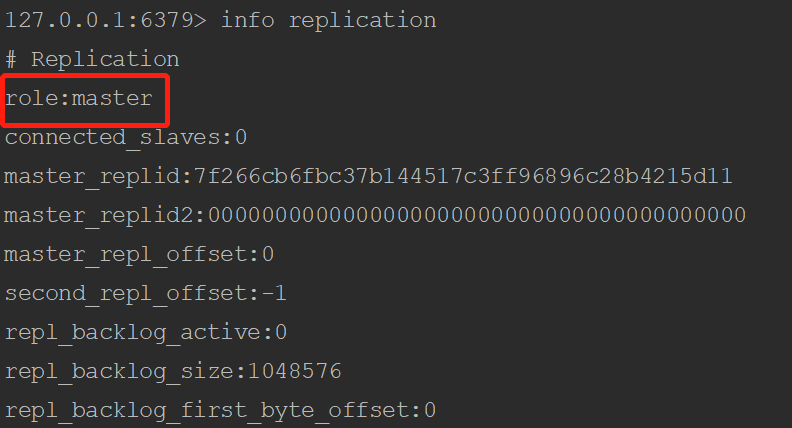
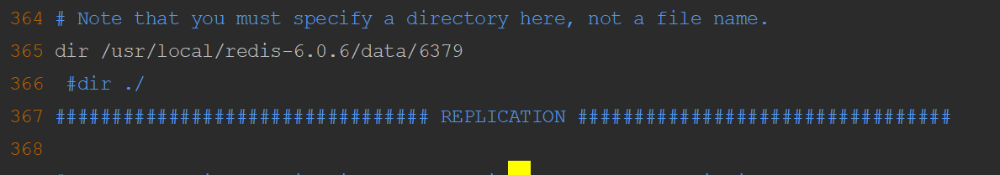
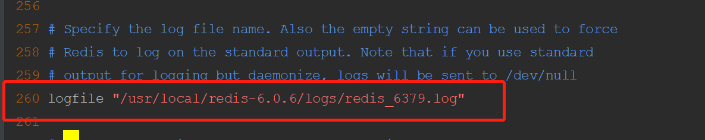
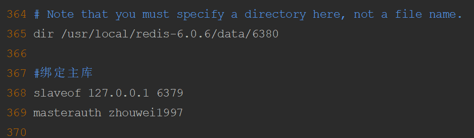

# Redis主从搭建架构及哨兵模式

## 基本架构
本实例采用在同一台机器上搭建多实例的方式安装Redis，采用不同的端口进行主从复制

### Redis配置
1、按照1主2从的结构搭建，即1个Master，2个Slaver节点

2、Redis配置文件redis.conf的配置 
```shell
master 192.168.220.136:6379
slave 192.168.220.136:6380
slave 192.168.220.136:6381
``` 
主从节点都要开启后台进程以及auth认证

## 修改配置文件
安装完成后，三个实例都是都是master节点，可以通过info replication指令来查看
```shell
#启动三个实例
/usr/local/redis-6.0.6/bin/redis-server /usr/local/redis-6.0.6/etc/redis_6379.conf
/usr/local/redis-6.0.6/bin/redis-server /usr/local/redis-6.0.6/etc/redis_6380.conf
/usr/local/redis-6.0.6/bin/redis-server /usr/local/redis-6.0.6/etc/redis_6381.conf

#登录redis后查看
info replication
```


### 修改主节点的配置信息
```shell
vim /usr/local/redis-6.0.6/etc/redis_6379.conf

#修改dir目录，指定数据文件存放的位置
dir /usr/local/redis-6.0.6/data/6379
#指定日志文件的路径以及文件名
logfile "/usr/local/redis-6.0.6/logs/redis_6379.log"
```
 




### 修改从节点信息
```shell
#修改端口6380的配置信息
vim /usr/local/redis-6.0.6/etc/redis_6380.conf

#修改dir目录，指定数据文件存放的位置
dir /usr/local/redis-6.0.6/data/6380
#指定日志文件的路径以及文件名
logfile "/usr/local/redis-6.0.6/logs/redis_6380.log"
#绑定主库
#slaveof 中绑定的IP是根据配置文件中的bind值来设置
slaveof 127.0.0.1 6379
#绑定主库密码
masterauth zhouwei1997
#设置从库只能读
slave-read-only
```


## 哨兵开启

1、复制sentinel.conf文件到etc目录下

2、复制src目录下的redis-sentinel文件到bin目录下

3、进入etc目录，修改相关配置信息 
```shell
#复制多个sentinel并重命名，分别分配给不同端口
cd /usr/local/redis-6.0.6/etc
cp sentinel.conf /usr/local/redis-6.0.6/etc/sentinel_6379.conf
cp sentinel.conf /usr/local/redis-6.0.6/etc/sentinel_6380.conf
cp sentinel.conf /usr/local/redis-6.0.6/etc/sentinel_6381.conf
```
```shell
#sentinel_6379.conf文件

port 26379
daemonize yes
pidfile /var/run/redis-sentinel-6379.pid
logfile /usr/local/redis-6.0.6/logs/sentinel_6379.log
dir /usr/local/redis-6.0.6/data/sentinel_6379
#告诉sentinel去监听地址为ip:port的一个master，这里的master-name可以自定义，quorum是一个数字，指明当有多少个sentinel认为一个master失效时，master才算真正失效
sentinel monitor host_6379 127.0.0.1 6379 2
#指定需要多少生效时间，一个master才会被这个sentinel主观的认为不可用的，单位：毫秒，默认为30000毫秒
sentinel down-after-milliseconds host_6379 30000
#这个配置项指定了在发生failover主备切换时最多可以有多少个slave同时对新的master进行 同步。
#这个数字越小，完成failover所需的时间就越长，但是如果这个数字越大，就意味着越 多的slave因为replication而不可用。
#可以通过将这个值设为 1 来保证每次只有一个slave 处于不能处理命令请求的状态。
sentinel parallel-syncs host_6379 1
#当进行failover故障转移时，配置所有slaves指向新的master所需的最大时间
sentinel failover-timeout host_6379 180000
#避免脚本重置，默认值为yes
sentinel deny-scripts-reconfig yes
```
```shell
#sentinel_6380.conf文件

port 26380
daemonize yes
pidfile /var/run/redis-sentinel-6380.pid
logfile /usr/local/redis-6.0.6/logs/sentinel_6380.log
dir /usr/local/redis-6.0.6/data/sentinel_6380
sentinel monitor host_6379 127.0.0.1 6379 2
sentinel down-after-milliseconds host_6379 30000
sentinel parallel-syncs host_6379 1
sentinel failover-timeout host_6379 180000
sentinel deny-scripts-reconfig yes
```
```shell
#sentinel_6381.conf文件

port 26380
daemonize yes
pidfile /var/run/redis-sentinel-6381.pid
logfile /usr/local/redis-6.0.6/logs/sentinel_6381.log
dir /usr/local/redis-6.0.6/data/sentinel_6381
sentinel monitor host_6379 127.0.0.1 6379 2
sentinel down-after-milliseconds host_6379 30000
sentinel parallel-syncs host_6379 1
sentinel failover-timeout host_6379 180000
sentinel deny-scripts-reconfig yes
```
4、开启哨兵 
```shell
/usr/local/redis-6.0.6/bin/redis-sentinel /usr/local/redis-6.0.6/etc/sentinel_26379.conf
/usr/local/redis-6.0.6/bin/redis-sentinel /usr/local/redis-6.0.6/etc/sentinel_26380.conf
/usr/local/redis-6.0.6/bin/redis-sentinel /usr/local/redis-6.0.6/etc/sentinel_26381.conf
```


