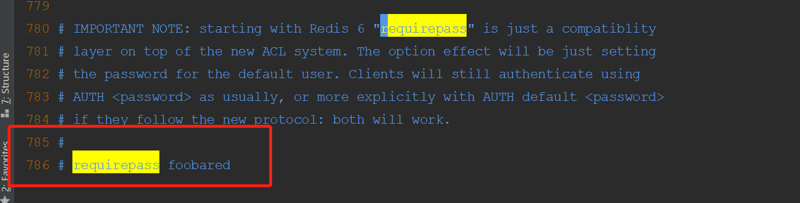
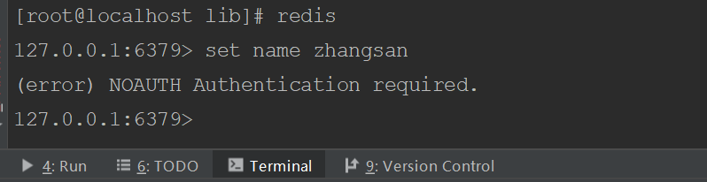
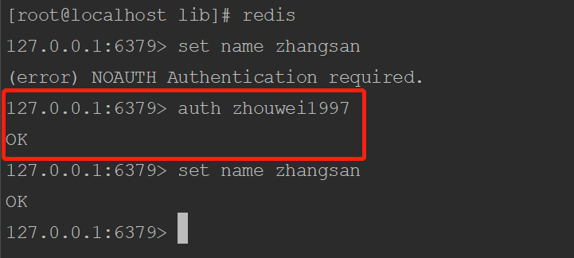
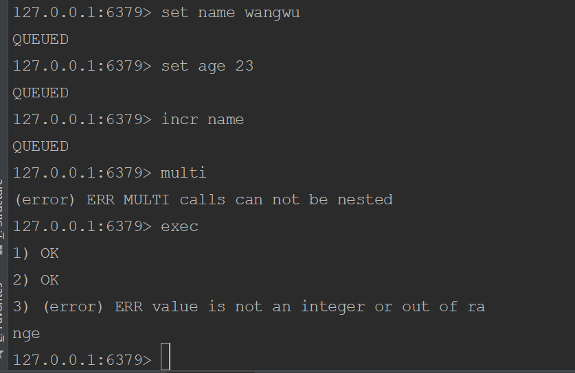

# Redis 其他配置

## Redis的AUTH机制
1、修改redis.conf文件 

    foobared前面的注释去掉，然后将foobared改为自己的需要设置的密码等
 

2、重启redis服务即可，再次使用redis的客户端登录 

    使用客户端登录时，连接时是不需要登录密码的
   
  
    在操作redis时，例如添加、删除key,mamebr等操作时，会报错，这时需要使用auth指令，输入刚才设置的密码后，再次执行操作即可
    
   

## Redis事务
    
    Redis的事务：一次事务操作，该成功的会成功，该失败的还是失败，没有事务回滚操作
   
   
   当一个事务中的某一个命令失败时，并不会影响到整个事务的执行
   
   开启事务：执行一些列的命令，但是不会立即去执行，会被放在一个队列中，如果执行事务，那么这个队列中的命令会全部执行，如果取消了事务，一个队列中的命令会全部作废
   ``` powershell
   1、开启事务：multi
   2、输入要执行的命令：被放入到一个队列中
   3、执行事务：exec
   4、取消事务：discard
   ```
   Redis的事务想要发挥功能，需要配置watch命令去监听一个或多个key，在开启事务之后，如果有其他客户端修改了监听的key，则事务会被取消
   
   如果执行了事务，或者取消了事务，watch监听会自动取消，一般不需要手动执行unwatch
   
## Redis持久化机制
   
### RDB持久化参数配置
RDB是Redis默认的持久化机制 
```
1、RDB持久化文件，速度比较快，而且存储的是一个二进制文件，传输比较方便
2、RDB持久化的时机：
    save 900 1  #在900秒内，有1个key改变了，就执行RDB持久化
    save 300 10 #在300秒内，有10个key改变了，就执行RDB持久化
    save 60 10000 #在60秒内，有10000个key改变了，就执行RDB持久化
 3、RDB无法保证数据的绝对安全
```

```powershell
#在900秒内，存在一个key被改变则执行RDB持久化
save 900 1
save 300 10
save 60 10000

#开启RDB持久化的压缩
rdbcompression yes
    
#RDB持久化文件的名称
dbfilename dump.rdb
```

### AOF持久化机制
AOF持久化机制默认是关闭的，Redis官方推荐同时开启RDB和AOF 
```powershell
1、AOF持久化的速度相对于RDB较慢，存储的是一个文本文件，到后期文件会比较大，传输比较困难
2、AOF持久化的时机
    appendfsync always    #每执行一个写操作，立即持久化到AOF文件中，性能比较低
    appendfsync everysec  #每秒执行一次持久化（默认的执行时机）
    appendfsync no        #根据操作系统的不同、环境的不同，在一定时间内执行一次持久化
3、AOF相对RDB更安全，推荐同时开启AOF和RDB
```
```shell
#AOF机制是否开启
appendonly no
#AOF文件的名称
appendfilename "appendonly.aof"

#AOF持久化执行的时机
appendfsync always
appendfsync everysec
appendfsync no
```
如果同时开启了AOF和RDB持久化，那么在Redis宕机重启之后，需要加载一个持久化文件，优先选择AOF文件。

如果先开启了RDB，再次开启AOF，如果RDB执行了持久化，那么RDB文件中的内容会被AOF覆盖掉
