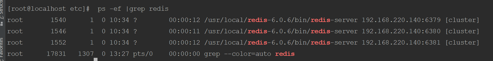
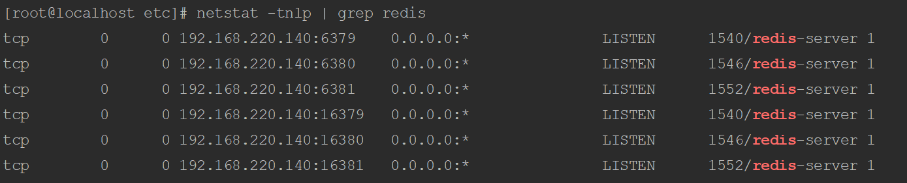
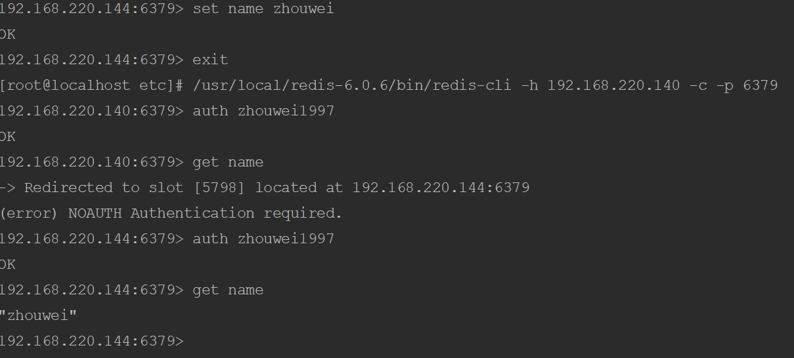

# Redis集群搭建

环境准备

两台机器，分别开启三个redis服务（端口）

192.168.220.140 6379/6380/6381 

192.168.220.144 6379/6380/6381

两台服务器的redis均安装在/usr/local/redis-6.0.6目录下。启动时使用的配置文件不相同，分别在于/usr/local/redis-6.0.6/etc目录下，分别为redis_6379.conf，redis_6380.conf和redis_6381.conf

## 搭建rvm环境
redis的集群搭建后期需要ruby环境，所以提前搭建 

### 通过yum安装ruby 和依赖的包
```shell
yum -y install ruby ruby-devel rubygems rpm-build
```

### 查看当前ruby版本
redis 5及其以上的版本需要使用ruby 2.3.0以上的版本
```shell
ruby -v
```

### 安装rvm
#### 安装ruby所需的其他依赖包
```shell
yum install gcc-c++ patch readline readline-devel zlib zlib-devel libyaml-devel libffi-devel openssl-devel make bzip2 autoconf automake libtool bison iconv-devel sqlite-devel
```

#### 修改ruby的gem源
```shell
#查看当前使用的源
gem sources
#添加阿里云的源地址
gem sources -a http://mirrors.aliyun.com/rubygems/ 
#删除默认的源地址
gem sources -r https://rubygems.org/ 
#更新源的缓存
gem sources -u 
```

### 安装rvm 
#### 获取秘钥
```shell
gpg --keyserver hkp://keys.gnupg.net --recv-keys 409B6B1796C275462A1703113804BB82D39DC0E3 7D2BAF1CF37B13E2069D6956105BD0E739499BDB
```

#### 安装rvm
```shell
curl -sSL https://get.rvm.io | bash -s stable

#如果上面的命令无法使用，可以考虑下面的一行
curl -L https://raw.githubusercontent.com/wayneeseguin/rvm/master/binscripts/rvm-installer | bash -s stable
```

#### 更新配置文件
```shell
source /etc/profile.d/rvm.sh
```

### 通过rvm升级ruby
#### 查看rvm支持的ruby版本信息
```shell
rvm list known
```
#### 安装ruby 2.6
```shell
rvm install 2.6
```

## 修改配置文件
修改三个端口的对应conf配置文件
```shell 
#此处以修改redis_6379.conf文件为例

vim /usr/local/redis-6.0.6/etc/redis_6379.conf

#修改对应的端口号，三个配置文件文件的端口号分别为6379,6380,6381
port  6379  
#修改为本地IP，外部可以访问的IP地址       
bind 本机ip   
#开启后台运行，默认为no
daemonize    yes    
#开启AOF日志
appendonly  yes     
#pid文件位置
pidfile  /var/run/redis_6379.pid  
#开启集群
cluster-enabled  yes   
#集群的配置  配置文件首次启动自动生成 7000,7001,7002        
cluster-config-file  nodes_7000.conf  
# 请求超时  默认15秒，可自行修改
cluster-node-timeout  15000  
```
该台服务器配置号后，修改另外一台服务器的配置

## 启动各个节点
```shell
#在开启redis的时候，需要指定其conf配置文件的路径
/usr/local/reids-6.0.6/bin/redis-server /usr/local/redis-6.0.6/etc/redis_6379.conf
/usr/local/reids-6.0.6/bin/redis-server /usr/local/redis-6.0.6/etc/redis_6380.conf
/usr/local/reids-6.0.6/bin/redis-server /usr/local/redis-6.0.6/etc/redis_6381.conf

#第二台服务器
/usr/local/reids-6.0.6/bin/redis-server /usr/local/redis-6.0.6/etc/redis_6379.conf
/usr/local/reids-6.0.6/bin/redis-server /usr/local/redis-6.0.6/etc/redis_6380.conf
/usr/local/reids-6.0.6/bin/redis-server /usr/local/redis-6.0.6/etc/redis_6381.conf
```

## 检查启动情况
```shell
ps -ef|grep redis
netstat -ntlp|grep redis
```
 

## 集群搭建
Redis官方提供的redis-trib.rb工具在redis安装后位于src目录下，需要提前将其备份到bin目录下（为了使用方便）

如果Redis设置了密码的话，在创建集群的时候需要使用-a参数带上密码
```shell
cp /usr/local/redis-6.0.6/src/redis-trib.rb /usr/local/redis-6.0.6/bin/redis-trib.rb
#Redis官方提供了该工具用于搭建集群，但是在6.0版本的使用过程中有警告，提示使用redis-cli工具来搭建集群
/usr/local/redis-6.0.6/bin/redis-trib.rb create --replicas 1 192.168.220.140:6379 192.168.220.140:6380 192.168.220.140:6381 192.168.220.144:6379 192.168.220.144:6380 192.168.220.144:6381

# -a参数后带入redis密码
/usr/local/redis-6.0.6/bin/redis-cli --cluster create 192.168.220.140:6379 192.168.220.140:6380 192.168.220.140:6381 192.168.220.144:6379 192.168.220.144:6380 192.168.220.144:6381 --cluster-replicas 1 -a zhouwei1997
```

## 集群验证
在192.168.220.140服务器上开启6380节点，在192.168.220.144服务器上开启6381节点
```shell
# 加 -c 参数  连接到集群
# conf文件中的bind 已经改为了IP地址，需要加上 -h 参数
/usr/local/redis-6.0.6/bin/redis-cli -h 192.168.220.140 -c -p 6380
```
在192.168.220.140:6379上执行set指令 
```redis
set test test_01
```
在192.168.220.140:6379上查看key为test的内容 
```redis
get test
```


