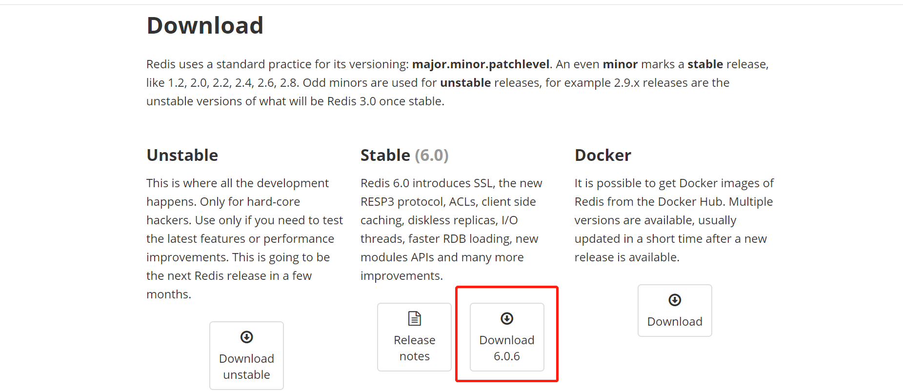
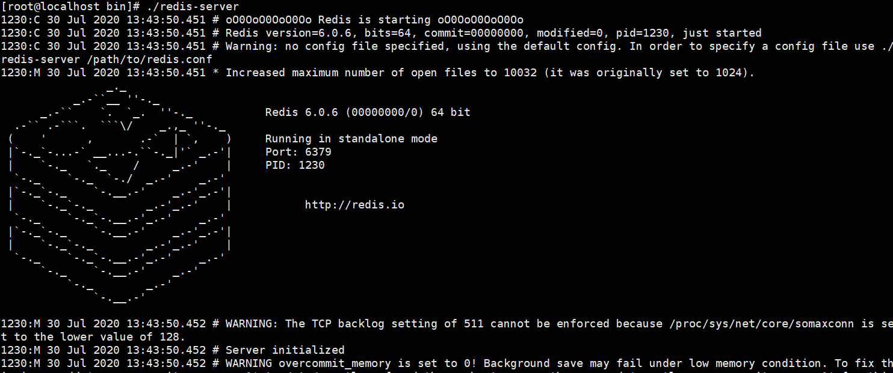
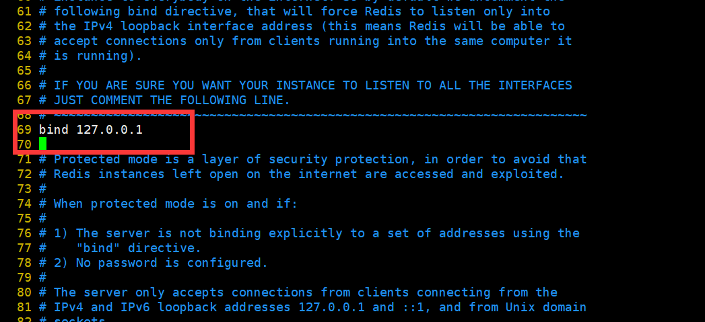
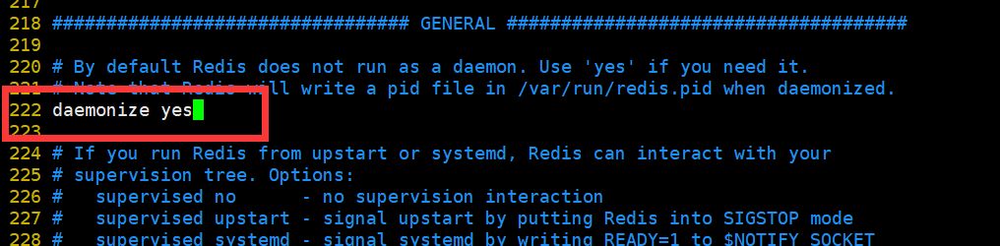
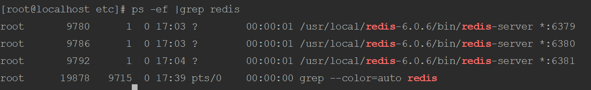

# Redis多实例安装

## 安装


### 一、下载Redis

    访问官网下载地址  https://redis.io/download 通常情况下下载最新的安装包



### 二、安装

#### 2.1、上传Redis文件到服务器上

    使用rz命令将下载的安装包上传至服务器的/opt目录下

#### 2.2、解压

`tar zxvf redis-6.0.6.tar.gz`

将解压的目录文件复制到/usr/local/下，并重命名为redis

`mv redis-6.0.6 /usr/local/redis`

进入Redis目录下，然后进行编译

`cd /usr/local/redis`

`make` 

编译完成后，进入`cd /usr/local/redis/src`目录下进行

执行`make install` 

### 三、部署

#### 3.1、创建目录

##### 3.1.1、创建bin和etc目录

etc目录用来存放Redis的配置文件，只要是redis.conf文件。bin目录用来存放Redis的常用命令

`mkdir etc`

`mkdir bin`

##### 3.1.2、移动redis.conf到etc目录下

`mv redis.conf /usr/local/redis/etc/`

进入src目录，移动mkreleasehdr.sh redis-benchmark redis-check-aof redis-check-rdb redis-cli redis-server到/usr/local/redis/bin/

`cd src`

`mv mkreleasehdr.sh redis-benchmark redis-check-aof redis-check-rdb redis-cli redis-server /usr/local/redis/bin/`

#### 3.2、启动Redis

`./redis-server`



#### 3.3、绑定IP（不需要可以省略）

`vim /usr/local/redis/etc/redis.conf`



将其中的127.0.0.1修改为指定的IP地址

#### 3.4、设置为后台启动

##### 3.4.1、修改conf配置文件

编辑conf配置文件，将daemonize属性改为yes（表明需要在后台运行）

`cd etc`

`vim redis.conf`

默认的属性值为no，将其改为yes后退出保存
##### 3.4.2、重启redis服务
重启redis服务，并指定conf配置文件的位置
`./redis-server /usr/local/redis/etc/redis.conf`

## 多实例配置
redis的多实例安装并不需要安装多个redis软件，只需要修改相关配置即可 

单机多实例安装采用6379/6380/6381三个端口

```shell
#切换至etc目录下
cd /usr/local/redis/etc/
#将该目录下的redis.conf文件拷贝三份，分别命名为redis_6379.conf、redis_6380.conf和redis_6381.conf
cp redis.conf /usr/local/redis/etc/redis_6379.conf
cp redis.conf /usr/local/redis/etc/redis_6380.conf
cp redis.conf /usr/local/redis/etc/redis_6381.conf
```
修改conf文件中的相关配置 

```
1、修改端口号，三个文件的端口号分别为6379/6380/6381
2、开启后台运行
    将配置文件中的daemonize属性改为yes
3、开启auth登录
    将配置文件中的 requirepass foobared前面的注释去掉，然后将foobared改为需要设定的密码
4、为了后期搭建集群方便，修改bind 为0.0.0.0
```
重启三个redis实例 
```shell 
 /usr/local/redis-6.0.6/bin/redis-server  /usr/local/redis-6.0.6/etc/redis_6379.conf
 /usr/local/redis-6.0.6/bin/redis-server  /usr/local/redis-6.0.6/etc/redis_6380.conf
 /usr/local/redis-6.0.6/bin/redis-server  /usr/local/redis-6.0.6/etc/redis_6381.conf
```
查看redis进程 

连接三个实例的客户端 
```shell
/usr/local/redis-6.0.6/bin/redis-cli -p 6379
/usr/local/redis-6.0.6/bin/redis-cli -p 6380
/usr/local/redis-6.0.6/bin/redis-cli -p 6381
```


