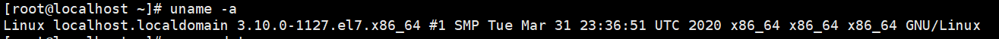
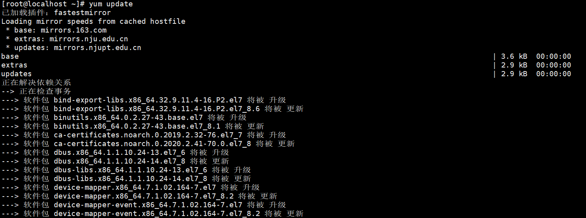
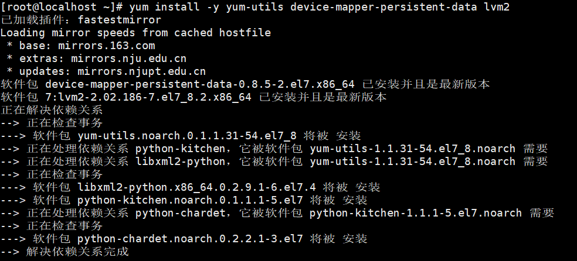
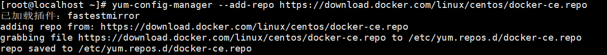
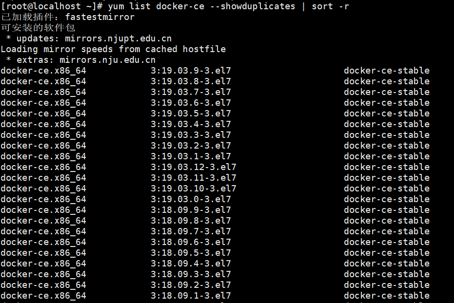
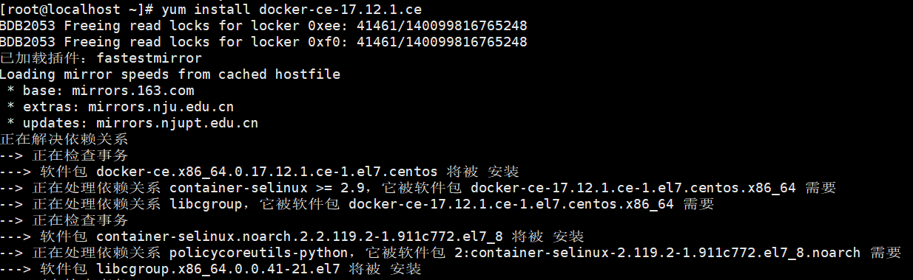

# Docker安装

1、查看系统的内核 
```shell
uname -a
```


2、更新yum包 

该步骤非选，根据操作系统的实际情况进行更新操作
```shell
yum update -y
```


3、安装需要的软件包

yum-util 提供yum-config-manager功能，另外两个是devicemapper驱动依赖的
```shell
yum install -y yum-utils device-mapper-persistent-data lvm2
```


4、设置yum源 
```shell
yum-config-manager --add-repo https://download.docker.com/linux/centos/docker-ce.repo
```


5、查看所有仓库中所有docker版本
```shell
yum list docker-ce --showduplicates | sort -r
```


6、安装docker 
```shell
yum install docker-ce-17.12.1.ce -y
```


7、docker启动、查看、停止
```shell
#启动docker
systemctl start docker
#查看docker状态
systemctl status docker
#停止docker
systemctl stop docker
#设置开机自启动
systemctl enable docker
```

8、配置镜像加速 

进入阿里云的开发者平台获取加速地址
https://cr.console.aliyun.com/#/accelerator

在系统的/etc/docker目录下新建daemon.json文件
```shell
vim /etc/docker/daemon.json
```
在其中添加以下内容
```json
{"registry-mirrors": ["https://dhdnrf5v.mirror.aliyuncs.com"]}
```
保存后退出，并重启docker容器 
```shell
systemctl daemon-reload
systemctl restart docker
```
