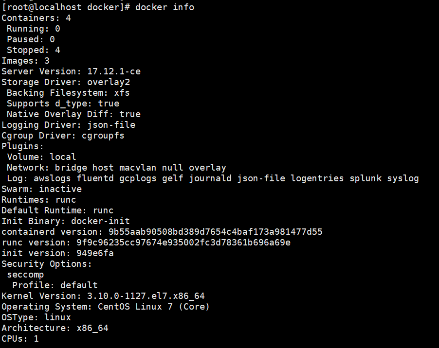

# Docker常用命令

## 帮助命令
### 查看docker版本信息
```shell
#查看docker版本信息
docker version
```
 

### 查看docker详细信息
```shell
#查看docker详细信息
docker info
```
 

### docker帮助命令
```shell 
docker --help
```

## 镜像命令

### 列出本地主机上的镜像
```shell
docker images [options]
```
 
```
REPOSITORY   表示镜像的仓库源 
TAG          镜像的标签
IMAGE ID     镜像ID
CREATED      镜像创建的时间
SIZE         镜像大小
```
同一仓库源可以有多个TAG，代表这个仓库源的不同版本，通常使用REPOSITORY:TAG来定义不同的镜像。如果不指定一个镜像的版本标签，docker则默认使用latest镜像

#### option说明
```
-a          列出本地所有的镜像,包含中间映像层 
-q          只显示镜像ID
--digests   显示镜像的摘要信息
--no-trunc  显示完整的镜像信息
```

### 寻找某个镜像

默认是从http://hub.docker.com上查找镜像
```shell
docker search [options] [image]
```
#### option说明
```
--no-trunc    显示完整的镜像描述
-s            列出收藏数不小于指定值的镜像
--automated   只列出automated build类型的镜像           
```

### 从镜像仓库中拉取或者更新指定镜像
```shell
docker pull [OPTIONS] NAME[:TAG|@DIGEST]
```
#### option说明
```
-a                         拉取所有tagged镜像
--disable-content-trust    忽略镜像的校验，默认开启
```

### 删除本地一个或多少镜像
```shell
docker rmi [OPTIONS] IMAGE [IMAGE...]

#删除单个
docker rmi -f 镜像ID
#删除多个
docker rmi -f 镜像名1:TAG 镜像名2:TAG 镜像名3:TAG ...
#删除全部
docker rmi of $(docker images -qa)
```
#### option说明
```
-f              强制删除
--no-prune      不移除该镜像的过程镜像，默认移除
```

## 容器命令

### 新建并启动容器
```shell
docker run [OPTIONS] IMAGE [COMMAND][AGE...]

```
#### OPTIONS说明
```
--name="容器新名字"          为容器指定一个名称
-d                          后台运行容器，并返回容器ID，即为启动守护式容器
-i                          以交互式模式运行容器，通常与-t同时使用
-t                          为容器重新分配一个伪输入终端，通常与-i同时使用
-P                          随机端口映射
-p                          指定端口映射,通常有以下四种方式
        ip:hostPort:containerPort
        ip::containerPort
        hostPort:containerPort
        containerPort                 
```
### 列出当前所有正在运行的容器 
```shell
docker ps [OPTIONS]
```
#### options
```
-a            显示所有的容器，包括未运行的。
-f            根据条件过滤显示的内容。
--format      指定返回值的模板文件。
-l            显示最近创建的容器。
-n            列出最近创建的n个容器。
--no-trunc    不截断输出。
-q            静默模式，只显示容器编号。
-s            显示总的文件大小。
```
### 退出容器
```shell
#退出容器有两种方式

#容器停止退出
exit

#容器不停止退出
ctrl+P+Q
```
### 启动容器
```shell
docker start [OPTIONS] CONTAINER [CONTAINER...]
```
### 重启容器
```shell
docker restart [OPTIONS] CONTAINER [CONTAINER...]
```
### 停止容器
```shell
docker stop [OPTIONS] CONTAINER [CONTAINER...]
```
### 强制停止容器
```shell
docker kill [OPTIONS] CONTAINER [CONTAINER...]

-s   向容器中发送一个信号

docker kill -s KILL mynginx
```
### 删除已停止的容器
```shell
docker rm [OPTIONS] CONTAINER [CONTAINER...]

-f    通过SIGKILL信号强制删除一个运行中的容器
-l    移除容器间的网络连接,而非容器身
-v    删除与容器关联的卷

docker rm -f db01 db02

docker rm -l db

docker rm -v nginx01

docker rm $(docker ps -a -q)
```
### 查看容器日志
```shell
docker logs -f -t --tail 容器ID

-t  加入时间戳
-f  跟随最新的日志打印
```
### 查看容器内运行的进程
```shell
docker top 容器ID
```
### 查看容器内部细节
```shell
docker inspect 容器ID
```
### 进入正在运行的容器并以命令行交互
```shell
docker exec -it 容器ID BashShell
docker attach -it 容器ID

#两种方式的区别
attach     直接进入容器启动命令的终端,不会启动新的进程
exec       在容器中打开新的终端,并且可以启动新的进程
```
### 从容器内拷贝文件到主机上
```shell
docker cp 容器ID:容器内路径  目的主机路径
```
